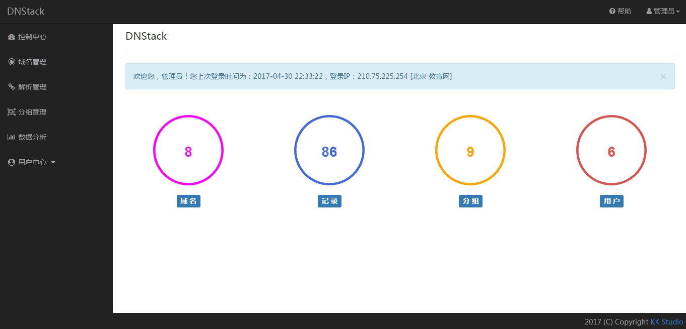
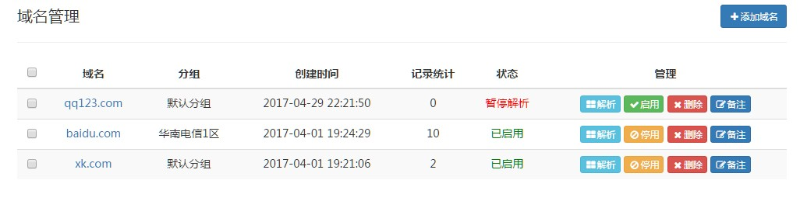
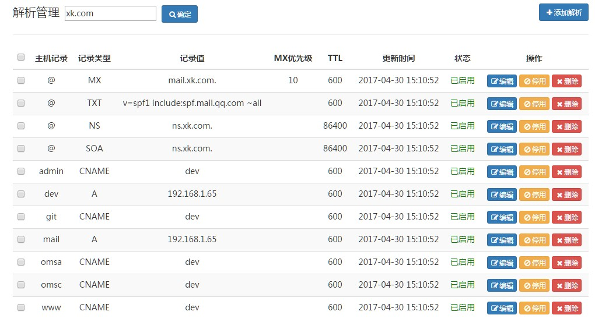
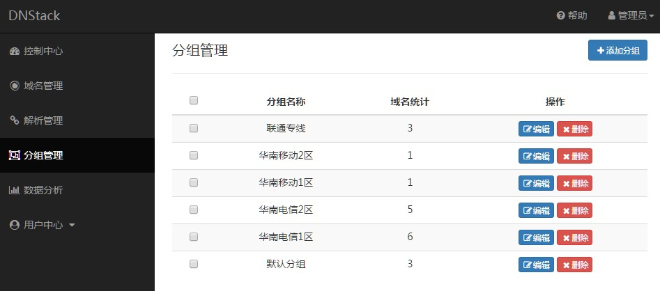

DNStack
=======

DNS Web Admin Based on Bind

Powered By [KK Studio](http://github.com/kkstu)

Version: **0.0.1-Alpha**


## Overview

#### Dashboard




#### Domain Admin




#### Record




#### Group




## Dependency Component

- [Bind](http://www.isc.org)：9.9+

- [Torweb](https://github.com/kkstu/Torweb)：1.0+

- [Tornado](http://www.tornadoweb.org/)：4.0+

- [SQLAlchemy](http://www.sqlalchemy.org/)：1.1.9

- [Jinja2](http://jinja.pocoo.org/)：2.9+

- [MySQL](http://www.percona.com/)：Percona-Server 5.5/5.6

- [MySQL-python](http://pypi.python.org/pypi/MySQL-python)：1.2.5+

- [Redis-Py](https://github.com/andymccurdy/redis-py)：2.10+

- [Python](http://www.python.org)：2.6.x/2.7.x


## Deployment

#### Install Bind

```shell
# Remove Bind (System)
yum remove bind*

# Downlaod Bind
wget https://ftp.isc.org/isc/bind9/9.11.0-P5/bind-9.11.0-P5.tar.gz

# Decompress
tar zxf bind-9.11.0-P5.tar.gz

# Configure
cd bind-9.11.0-P5
./configure --prefix=/usr/local/bind \
--enable-epoll \
--enable-threads=no \
--enable-largefile \
--enable-ipv6 \
--with-openssl=no \
--with-readline \
--with-dlz-mysql=/usr/local/mysql \
--with-python=/usr/local/python2.7/bin/python2.7

# Install
make -j 2
make install

ln -s /usr/local/bind/bin/dig /usr/bin
ln -s /usr/local/bind/bin/nslookup /usr/bin
ln -s /usr/local/bind/sbin/named /usr/sbin
ln -s /usr/local/bind/sbin/rndc /usr/sbin
```

#### Configure Named

Generate rndc.conf

```shell
cd /usr/local/bind/etc
../sbin/rndc-confgen > rndc.conf
```


named.conf

```
key "rndc-key" {
 	algorithm hmac-md5;
 	secret "kzIcztY4+xH0Px2SrsZyGQ==";
};

controls {
	inet 0.0.0.0 port 953
	    allow { any; } keys { "rndc-key"; };
};

logging {
    channel query_log {
        file "/usr/local/bind/var/log/query.log" versions 1024 size 100m;
        severity info;
        print-category no;
        print-severity no;
        print-time yes;
    };
    category queries { query_log; };
};

options {
    listen-on port 53 { any; };
    listen-on-v6 { none; };
    directory "/usr/local/bind/var";
    pid-file "run/named.pid";
    dump-file "cache_dump.db";
    statistics-file "named.stats";
    memstatistics  yes;
    memstatistics-file "named.memstats";
    allow-query { any; };
    forwarders { 114.114.114.114; 8.8.8.8; };
};

statistics-channels {
    inet 0.0.0.0 port 8053 allow { any; };
};

include "/usr/local/bind/etc/local.zone.conf";
//include "/usr/local/bind/etc/zone.conf";
include "/usr/local/bind/etc/dlz_mysql.conf";
```

dlz_mysql.conf

```
dlz "mysql zone" {
    database "mysql
    {host=127.0.0.1 dbname=dnstack ssl=false port=3306 user=test pass=test}
    {select zone from domain where status = 1 and zone = '$zone$' limit 1}
    {select ttl, type, mx_priority, case when lower(type)='txt' then concat('\"', data, '\"') when lower(type) = 'soa' then concat_ws(' ', data, resp_person, serial, refresh, retry, expire, minimum) else data end from record where status = 1 and zone = '$zone$' and host ='$record$'}";
};
```

#### Start Named

> named -c /usr/local/bind/etc/named.conf

#### Control Named

- Get Running Status

> rndc status

- Reload

> rndc reload

- Reload config file

> rndc reconfig

- Shutdown Name

> rndc halt


## Configure Database

Create a database

> mysql> create database dnstack;

Import SQL

> mysql dnstack < [docs/data.sql](docs/data.sql)

Config file config/settings.py

```
config = {
    'db': {
        'host': '127.0.0.1',
        'port': 3306,
        'db': 'dnstack',
        'user': 'test',
        'passwd': 'test',
        'charset': 'utf8'
    },
    'redis': {
        'host': '127.0.0.1',
        'port': 6379,
        'password': '',
        'db': '0'
    },
    ......
}
```

## Startup

> python run.py

You can visit the site via http://YourIP:8888/

Specify Port:

> python run.py --port=8081


## Get Support and Help

To report an issue with DNStack.

https://github.com/kkstu/DNStack/issues


## Contributors

After the version 1.0-Stable release.